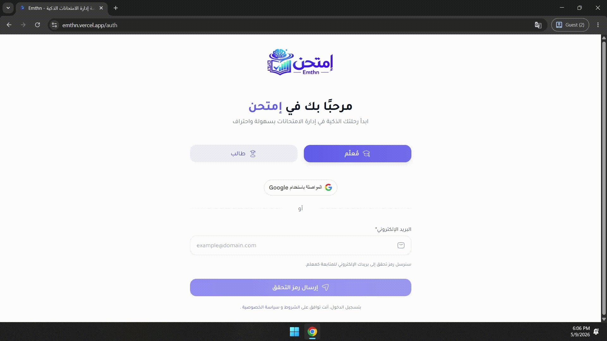
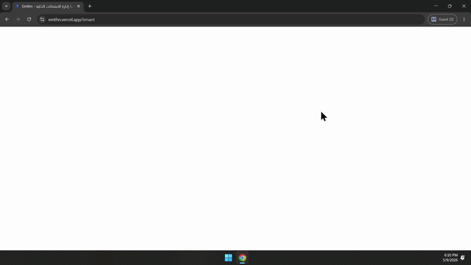

<div align="center">

# 🎓 Emthn — إدارة الامتحانات الذكية

**Enterprise SaaS Exam Management Platform**

*Built end-to-end with Angular (v16+) & .NET Web API*

[](https://emthn.vercel.app)
[](https://angular.io)
[](https://dotnet.microsoft.com)
[](https://www.typescriptlang.org)

</div>

---

## 📌 Overview

**Emthn** is a full-stack SaaS platform for smart exam management — built for teachers who need full control over creating, targeting, and analyzing exams, and for students who need a clean, distraction-free exam experience.

The platform supports **multi-tenant architecture**, meaning each school or institution operates in its own isolated environment with its own data, users, and settings.

> Built solo from scratch — frontend, backend, database design, and deployment.

---

## 🏗️ Tech Stack

| Layer | Technology |
|---|---|
| Frontend | Angular v16+, TypeScript, RxJS, NgRx Signals |
| Backend | .NET Web API, Clean Architecture |
| Auth | JWT Authentication, Role-based Access Control (RBAC) |
| Real-time | SignalR |
| Database | SQL Server |
| Hosting | Vercel (frontend) |
| UI | Angular Material, SCSS, Responsive / Mobile-first |

---

## ✨ Features

### 1. 🔐 Authentication & Role Management

Two distinct portals — **Teacher** and **Student** — each with its own dashboard, permissions, and UX. Auth is handled via JWT tokens issued on the backend and validated on every route using Angular guards.

- Google OAuth login
- Magic link (email OTP) login
- Role-aware UI rendering — teachers see management tools, students see their exams only
- Route guards block unauthorized access client-side; middleware enforces it server-side

<div align="center">
  
</div>

---

### 2. 📊 Teacher Dashboard

The command center for every teacher. At a glance: active exams, upcoming exams, incomplete drafts, student count, average scores, and a results chart — all personalized per tenant.

- Quick action shortcuts (create exam, add student, add class)
- Live exam progress tracking
- Incomplete exam alerts

<div align="center">
  
</div>

---

### 3. 📝 Exam Creation — Multi-Step Wizard

Creating an exam follows a guided 4-step wizard: Basic Info → Targeting → Questions → Review.

#### Step 1 — Basic Info
Configure exam name, subject, chapter, difficulty level, duration, start time, and behavioral settings (shuffle questions, allow backtracking, show choices).

<div align="center">
  
</div>

#### Step 2 — Targeting
Define exactly who takes this exam — select specific classes, student groups, or individual students. The targeting engine supports combining multiple dimensions.

<div align="center">
  
</div>

#### Step 3 — Select Questions
Pick questions directly from the Question Bank. Questions are filterable by subject, chapter, difficulty, and type. The counter updates in real time as you add/remove.

<div align="center">
  
</div>

#### Step 4 — Review & Publish
Full summary before going live: exam name, target audience, question count, total score, duration, and all settings — with one-click publish or save as draft.

<div align="center">
  
</div>

---

### 4. 🗂️ Question Bank

A reusable library of questions scoped per teacher and subject. Questions can be created once and reused across multiple exams.

- Filter by subject, chapter, difficulty, and question type
- Search by question text
- Edit or delete questions independently of exams
- Questions carry metadata: subject, chapter, difficulty badge, type tag

<div align="center">
  
</div>

#### Creating a Question
Add MCQ or True/False questions with full configuration — correct answer, difficulty level, subject, and chapter assignment.

<div align="center">
  
</div>

---

### 5. 📚 Subjects & Chapters

Organize content hierarchically: Subjects → Chapters. Questions and exams are scoped to specific chapters, giving teachers fine-grained control over what's being tested.

- Create and manage subjects per school
- Add chapters inside each subject
- Chapter-level question filtering in the bank and exam wizard

<div align="center">
  
</div>

---

### 6. 🎯 Exam Management & Filters

All exams in one place — filterable by status (Draft, Active, Completed), difficulty, subject, and date. The table shows all key info at a glance: title, difficulty, date, time, duration, questions, and target audience.

<div align="center">
  
</div>

#### Exam Profile
Each exam has a dedicated profile page showing its full configuration, status, targeting details, and quick actions.

<div align="center">
  
</div>

---

### 7. 🏆 Grading System

Teachers create grade boundaries (A, B, C, etc.) with score ranges. The system auto-assigns grades when results are calculated — no manual grading needed.

<div align="center">
  
</div>

<div align="center">
  
</div>

---

### 8. 📈 Exam Insights & Analytics

After an exam closes, the teacher gets a full analytics page:

- Pass rate percentage with visual chart
- Score distribution across students
- Average score
- Students who didn't enter vs. who submitted
- Per-student breakdown: name, score, time taken, submission status

<div align="center">
  
</div>

#### Result Publishing Control
Teachers control exactly when students can see their results — results stay hidden until the teacher explicitly publishes them.

<div align="center">
  
</div>

---

### 9. 🎓 Student Portal

A completely separate portal for students. Clean, focused, distraction-free.

- See all active and upcoming exams assigned to them
- Live countdown timer per exam
- Start, pause, and resume exam attempts
- View submitted results (when published by teacher)
- Track completed vs. active exam count

<div align="center">
  
</div>

#### Exam UX
The in-exam experience is designed to keep students focused: one question at a time or paginated, with a visible timer, progress indicator, and clear submit flow.

<div align="center">
  
</div>

---

### 10. 📱 Responsive UI

The entire platform is mobile-first. Every page — from the teacher dashboard to the student exam portal — adapts cleanly to any screen size.

<div align="center">
  
</div>

---

## 🏛️ Architecture

```
Emthn/
├── Frontend (Angular v16+)
│   ├── Auth module           — JWT + Google OAuth, role-based routing
│   ├── Teacher module        — Dashboard, exams, questions, subjects, analytics
│   ├── Student module        — Portal, exam-taking, results
│   ├── Shared module         — Reusable components, guards, interceptors
│   └── State management      — Angular Signals + NgRx
│
└── Backend (.NET Web API)
    ├── Clean Architecture     — Domain / Application / Infrastructure / API layers
    ├── Multi-tenant           — Tenant-scoped data isolation per school
    ├── Auth                   — JWT issuance, refresh tokens, middleware
    ├── RBAC                   — Role-based permission enforcement
    └── Database               — SQL Server with EF Core
```

---

## 🔑 Key Technical Decisions

| Decision | Reason |
|---|---|
| Multi-tenant architecture | Each school's data is fully isolated — no cross-tenant data leaks |
| Clean Architecture on backend | Separation of concerns, testable, scalable without god-classes |
| Angular Signals for state | Simpler reactivity model than full NgRx for component-local state |
| JWT + middleware RBAC | Auth enforced at both UI (guards) and API (middleware) levels |
| Step-wizard for exam creation | Reduces cognitive load — teachers don't face a 20-field form at once |
| Result publishing control | Teachers control the student experience — no surprise result reveals |

---
